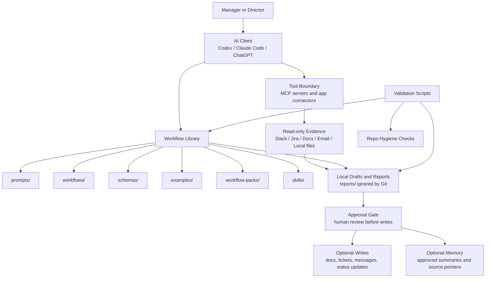

# Architecture

Manager OpenBrain is a thin operating layer over existing tools.

## Layers

1. Agent surface
   - Codex, Claude Code, or another approved AI client.

2. Tool boundary
   - App connectors and MCP servers.
   - Read-only by default.

3. Workflow library
   - Prompts, workflows, schemas, examples, and manifests.

4. Local outputs
   - Human-readable reports and notes.
   - Ignored by Git unless sanitized examples.

5. Optional memory
   - Local-first vector memory for approved summaries and source pointers.
   - External memory only after explicit approval for the data class.

## Recommended Flow

```text
source systems -> read-only evidence -> local report/draft -> approval gate -> optional write or memory update
```

## Architecture Diagram



## Non-Goals

- This repo is not a notes app.
- This repo is not a production automation runner.
- This repo does not configure live connectors by itself.
- This repo should not contain live credentials or raw company exports.
